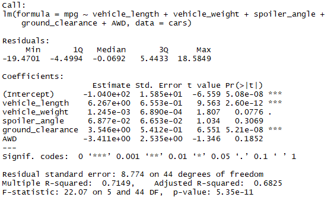
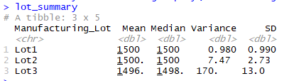
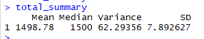
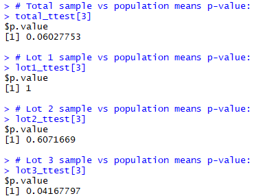

# Statistical Analysis of MechaCar Data

## Linear Regression to Predict MPG

**Which Variables provide non-random variance to the mpg values?**

The Vehicle Weight, Vehicle Length, and Ground Clearance all provide non-random variance to the mpg values. Vehicle weight is statistically much more reliable as a predictive variable.
**Is the slope of the linear model considered to be zero?**

Our assumed significance level is 0.05%, and the P-value of this linear model is well below that. Because we can reject the null hypothesis, the slope of the model is not zero.
**Does this linear model predict mpg of MechaCar prototypes effectively?**

Because our p-value (5.35e-11) is well below the 0.05% cutoff value, and our R-squared value is around 71.5%, this model does predict the mpg of MechaCar prototypes effectively.

## Summary Statistics on Suspension Coils

**The design specifications for the MechaCar suspension coils dictate that the variance of the suspension coils must not exceed 100 pounds per square inch. Does the current manufacturing data meet this design specification for all manufacturing lots in total and each lot individually?**

The total summary statistics show that the variance is only 62.29, which is less than 100 and thus meets the design specification. However, when broken down into by-lot summaries we can see that Lot3 has a variance of 170, which is well above the specified limit. 

## T-Tests on Suspension Coils

* For sampling from all manufacturing lots, there **is not** a statistical difference from the population mean of 1,500 
    * All lots: p=0.06, greater than 0.05, cannot reject null hypothesis
* For sampling from manufacturing lot 1, there **is not** a statistical difference from the population mean of 1,500 
    * Lot 1: p=1.0, greater than 0.05, cannot reject null hypothesis
* For sampling from manufacturing lot 2, there **is not** a statistical difference from the population mean of 1,500 
    * Lot 2: p=0.6, greater than 0.05, cannot reject null hypothesis
* For sampling from manufacturing lot 3, there **is** a statistical difference from the population mean of 1,500 
    * Lot 3: p=0.04, less than 0.05, reject null hypothesis

## Study Design: MechaCar vs Competition
A useful future test to conduct could analyze MechaCar's customers' total maintenenace costs in the first 5 years of owning a vehicle. The null hypothesis would be that MechaCar's customers do not spend significantly differently (alternatively, "do not spend significantly more") than the customers of other manufacturers in the first 5 years after buying a vehicle. To test this, an analysis could use T-tests to compare the means of MechaCar customer 5-year maintenance costs to the means of non-MechaCar customer 5-year maintenance costs. To do so would require data describing many vehicles' (MC and otherwise) maintenance costs over the first 5 years, most importantly enabling an analyst to determine the population average for first-5-year maintenance costs.

**Summary:**
* **Metric to be tested:** Average Total Maintenance costs for first 5 years of new vehicle ownership
* **Null hypothesis:** MechaCar customers do not spend significantly differently than customers of other vehicle manufacturers in the first 5 years after buying a new vehicle.
* **Statistical test to test hypothesis:** T-test
* **Data for the statistical test:** Customer maintenance cost information for many manufacturers' vehicles over the first 5 years, including MechaCar